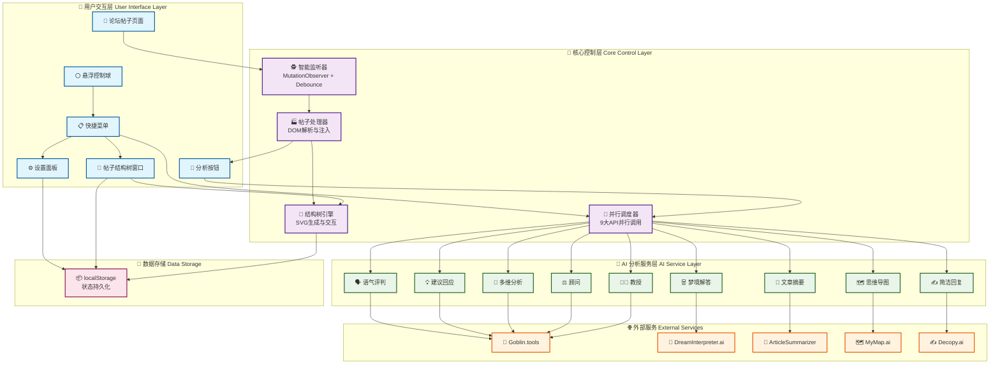
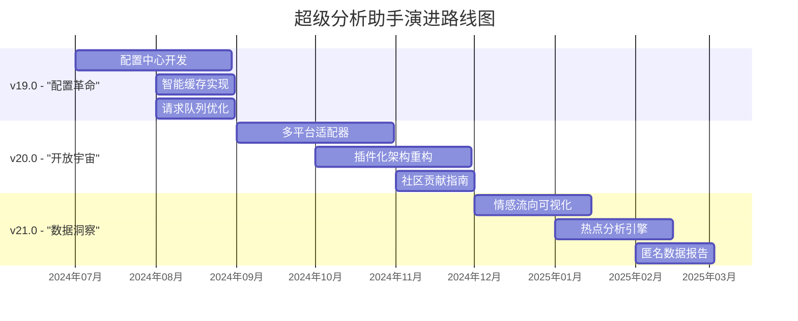

# 🤖 LinuxDo 超级分析助手 v18.1 - 终极思维可视化与分析引擎


**从「高情商沟通」到「全维度洞察」，这不仅是升级，更是一场认知革命。**

`v18.1` 是一个涅槃重生的版本。它彻底超越了单纯的文本分析，进化为一个集成了 **9 大 AI 模型** 和革命性 **「帖子结构树」** 的思维可视化与分析引擎。我们修复了所有已知的加载问题，确保在任何复杂的帖子下都能 100% 完美运行。

> **项目的核心哲学：** "重要的不是给出答案，而是点亮看清问题的所有角度。"
> 我们坚信，工具的终极意义是赋能人类。这个脚本并非要替代你的思考，而是要成为你思想的"显微镜"与"望远镜"，让你在信息的洪流中，既能洞察入微，又能高瞻远瞩。

---

## 📖 目录

- [🎯 项目概述与核心价值](#-项目概述与核心价值)
- [🚀 懒人福音：一键安装教程](#-懒人福音一键安装教程)
- [🛠️ 首次必读：配置向导](#️-首次必读配置向导)
- [🧭 使用指南：三分钟掌握神力](#-使用指南三分钟掌握神力)
- [🌟 九大核心模块全家桶](#-九大核心模块全家桶)
- [💡 核心原理与设计哲学](#-核心原理与设计哲学)
- [🔧 技术深度解析](#-技术深度解析)
- [🏗️ 系统架构详解](#️-系统架构详解)
- [🚧 项目现状与未来](#-项目现状与未来)
- [🤝 如何贡献](#-如何贡献)
- [📜 开源协议](#-开源协议)

---

## 🎯 项目概述与核心价值

**你是否也曾迷失在信息的海洋里？**

- **🤯 楼中楼的迷宫**：一个几百楼的热帖，你来晚了，只能看到零散的争论，却不知前因后果
- **🤔 观点的盲区**：面对复杂方案，感觉自己的思考总是在原地打转，无法跳出来审视全局
- **✍️ 表达的窘境**：想把想法转化为思维导图，却被繁琐的工具劝退
- **😰 沟通的误区**：一句话发出，总担心被误解？想给出得体回应却反复斟酌

**超级分析助手 v18.1，就是你穿越信息迷雾的"量子导航仪"！**

### ✨ 这个脚本为你带来了什么？

1. **👑 结构化洞察力**：革命性的「帖子结构树」，将混乱回复流重构为清晰对话树
2. **🧠 多维分析矩阵**：一键调用 9 个强大的 AI 模型，提供全方位"AI 智囊团"
3. **🚀 极致的便利性**：无需离开页面，所有分析都在帖子下方或浮动窗口中完成
4. **😌 愉悦的探索体验**：精心设计的 UI/UX，让信息探索充满流畅感和乐趣
5. **💖 鼓励与赋能**：激发你的思考深度和创造力，让你感觉自己更强大

---

## 🚀 懒人福音：一键安装教程

### 第一步：安装「篡改猴 (Tampermonkey)」浏览器扩展

- [Chrome / Edge / 国产浏览器 用户](https://chrome.google.com/webstore/detail/tampermonkey/dhdgffkkebhmkfjojejmpbldmpobfkfo)
- [Firefox 用户](https://addons.mozilla.org/firefox/addon/tampermonkey/)

### 第二步：安装「超级分析助手」脚本

👉 **[点击此处，注入灵魂！](https://github.com/lzA6/js-goblin/raw/main/LinuxDo%20%E8%B6%85%E7%BA%A7%E5%88%86%E6%9E%90%E5%8A%A9%E6%89%8B%20v18.1%20(%E7%BB%88%E6%9E%81%E5%8A%A0%E8%BD%BD%E4%BF%AE%E5%A4%8D%20&%20%E5%AE%8C%E6%95%B4%E5%8A%9F%E8%83%BD).user.js)** 👈

**完成了！** 🎉 现在打开任意 `linux.do` 帖子，体验"一切尽在掌握"的快感！

---

## 🛠️ 首次必读：配置向导

为了解锁全部 9 个 AI 模块的强大能力，有 **2 个模块** 需要简单的"手动绑定"。

**配置步骤：**

1. 点击浏览器右上角篡改猴图标 → **`管理面板`**
2. 找到 `LinuxDo 超级分析助手 v18.1` → 点击 **`编辑`**
3. 在最上方找到配置项：

```javascript
// --- 1. 配置项 ---
const USER_DREAM_COOKIE = '_gid=...'; // 粘贴梦境解答 Cookie
const DECOPY_PRODUCT_CODE = "067003"; // 粘贴 Decopy 产品代码
const DECOPY_PRODUCT_SERIAL = "eb0f..."; // 粘贴 Decopy 产品序列号
```

4. **获取凭证：**
   - **`USER_DREAM_COOKIE`**：访问 [DreamInterpreter.ai](https://www.dreaminterpreter.ai/)，按 F12 → 网络 → 分析梦境 → 复制 cookie
   - **`DECOPY` 凭证**：访问 [Decopy.ai](https://decopy.ai/ai-writer/)，按 F12 → 网络 → 复制 product-code 和 product-serial

5. **保存！** 按 `Ctrl + S`

现在，你的分析助手已是"完全体"！

---

## 🧭 使用指南：三分钟掌握神力

### 1. 核心入口：分析按钮 & 悬浮球

- **📝 单个帖子分析**：在每个帖子右下角操作栏点击 **LinuxDo 图标**
  - **单击**：在帖子下方展开/收起"AI智慧域"
- **🎯 全局控制悬浮球**：页面右下角的可爱悬浮球
  - **拖动**：按住拖到屏幕任意位置
  - **单击**：展开快捷菜单

### 2. 革命性功能：帖子结构树 🌳

**打开方式**：点击悬浮球菜单中的 `帖子结构树`

**交互体验：**
- **🔄 拖动 & 缩放**：窗口可拖动调整，树状图支持鼠标拖动和滚轮缩放
- **📂 折叠/展开**：点击节点右侧圆圈，折叠/展开回复分支
- **🎯 点击跳转**：单击树节点自动滚动到对应帖子并高亮
- **💾 状态记忆**：记住窗口位置、大小、视图状态

**强大工具栏：**
- `显示内容`：切换节点内容预览
- `居中视图`：一键优化视图
- `复制/导出`：导出为文本或 Markdown
- `日志`：查看运行过程

### 3. AI 分析卡片

每张卡片代表一位"AI专家"，右上角工具：
- **🔄 刷新**：重新分析
- **📋 复制**：一键复制报告
- **❌ 关闭**：关闭该分析
- **📜 日志**：查看分析过程

---

## 🌟 九大核心模块全家桶

| 图标 | 专家名 | 职能 | 颜色 | 简介 |
|------|--------|------|------|------|
| 🗣️ | **语气评判** | 情商扫描仪 | 蓝色 | 分析文本潜在语气和情绪 |
| 💡 | **建议回应** | 沟通策略师 | 黄色 | 提供多种风格的得体回应建议 |
| 🔄 | **多维分析** | 语言魔法师 | 蓝色 | 将内容转换为 5 种不同风格 |
| ⚖️ | **顾问** | 决策分析师 | 绿色 | 分析方案的利弊得失 |
| 👨‍🏫 | **教授** | 知识讲解员 | 紫色 | 深入浅出解释概念和示例 |
| 몽 | **梦境解答** | 弗洛伊德 | 深紫 | 对内容进行梦境解析（需配置） |
| 📄 | **文章摘要** | 速读机器人 | 天蓝 | 自动抓取链接文章并生成摘要 |
| 🗺️ | **思维导图** | 结构建筑师 | 橙色 | 生成可交互的思维导图 |
| ✍️ | **简洁回复** | 语言精炼师 | 青色 | 提炼简洁有力的回复（需配置） |

---

## 💡 核心原理与设计哲学

### 技术核心：优雅的四步协奏曲 🎼

1. **👀 智能守望**：`MutationObserver` + `debounce`，耐心等待页面加载完成
2. **🎯 无痕注入**：将功能按钮精准植入页面原生结构
3. **🚀 并行调度**：同时向 9 个 API 端点发出请求，`Promise` 机制优雅管理
4. **✨ 响应式呈现**：分析结果渲染为可交互的 UI 卡片和 SVG 图形

### 设计哲学：赋能而非替代

> "一个好的工具，是手的延伸；一个伟大的工具，是思想的延伸。"

- **无感植入，有感体验**：需要时触手可及，不需要时隐于无形
- **人是主体，AI 是辅助**：拓宽思路，激发灵感，决策权永远在你
- **从「线性」到「网状」**：通过结构树和思维导图，实现阅读维度跃迁

---

## 🔧 技术深度解析

| 技术模块 | 专业方案 | 通俗解释 |
|----------|----------|----------|
| **加载机制** | **Debounced `MutationObserver`** | **"有耐心的哨兵"**：等待人群稳定后再报告，完美解决动态加载问题 |
| **窗口系统** | **Draggable DOM + State Persistence** | **"能记住位置的桌子"**：窗口记住上次的位置和尺寸，像贴心的老朋友 |
| **异步处理** | **Promise-based API Wrapper & Polling** | **"靠谱的快递网络"**：标准化请求打包，异步任务轮询等待结果 |
| **UI 渲染** | **CSS-in-JS & Dynamic SVG** | **"随叫随到的装修队"**：样式独立稳定，动态生成可交互图形 |
| **交互逻辑** | **Event Delegation & State Management** | **"聪明的总指挥"**：事件委托高效处理，统一状态管理保证一致性 |

---

## 🏗️ 系统架构详解



### 架构核心亮点 ✨

1. **🎯 分层架构**：清晰的五层结构，各司其职，耦合度低
2. **🔄 事件驱动**：用户交互触发完整工作流，响应迅速
3. **⚡ 并行处理**：9大AI服务并行调用，极大提升效率
4. **💾 状态持久化**：所有用户偏好和界面状态本地保存
5. **🎨 响应式UI**：自适应不同屏幕尺寸和内容长度

---

## 🚧 项目现状与未来

### ✅ v18.1 已实现的里程碑

- [x] **终极加载修复**：100% 稳定加载，永不丢失帖子
- [x] **九大 AI 模块集成**：构建全面的 AI 分析矩阵
- [x] **革命性帖子结构树**：实现结构化洞察跃迁
- [x] **高级窗口系统**：可拖动、可缩放、状态持久化
- [x] **完善的 UI/UX**：悬浮球、设置面板、交互式 SVG

### ⚠️ 当前的不足

1. **凭证硬编码**：API 密钥需要直接修改代码，用户体验不佳
2. **样式耦合**：部分样式依赖论坛类名，改版可能失效
3. **缺乏请求缓存**：重复分析相同内容浪费资源
4. **错误处理待优化**：API 失败提示不够友好

### 🗺️ 未来演进路线图



**v19.0 - "配置革命"**
- 🎛️ 可视化配置中心，告别代码修改
- 💾 智能缓存，分析过的帖子秒出结果
- 🚦 请求队列管理，避免 API 限制

**v20.0 - "开放宇宙"**  
- 🌐 适配 V2EX、Reddit、贴吧等更多平台
- 🔌 插件化架构，轻松扩展新功能
- 👥 完善的社区贡献机制

**v21.0 - "数据洞察"**
- 😊 情感分析可视化
- 🔥 热点话题自动识别
- 📊 社区洞察数据报告

---

## 🤝 如何贡献

> "一个人可以走得很快，但一群人才能走得更远。"

我们欢迎任何形式的贡献：

- **💡 提出想法**：在 [GitHub Issues](https://github.com/lzA6/js-goblin/issues) 分享创意
- **🐛 报告 BUG**：详细描述问题和环境，帮助我们改进
- **💻 贡献代码**：Fork 项目，修复 BUG 或实现新功能
- **✍️ 完善文档**：让文档更清晰、更有趣
- **📣 宣传分享**：推荐给朋友，让更多人受益

> 我们相信，每个人心中都住着一个"奥特曼"，渴望用自己的光去创造、去守护。现在，就是你发光的时刻。

---

## 📜 开源协议

本项目采用 **Apache License 2.0** 开源协议。

**简单来说：**

- ✅ **你可以**：自由使用、修改、分发（包括商业用途）
- ✅ **你需要**：保留原始版权和协议声明
- ❌ **你无需**：将修改开源（但鼓励这样做！）

完整协议请参考 [LICENSE](https://github.com/lzA6/js-goblin/blob/main/LICENSE) 文件。

---

**愿代码的逻辑之美，与你同在。愿思想的自由之光，永远闪耀。Happy Hacking! 🚀**

---
