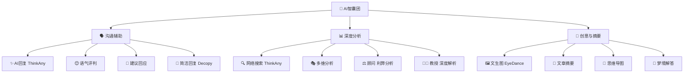
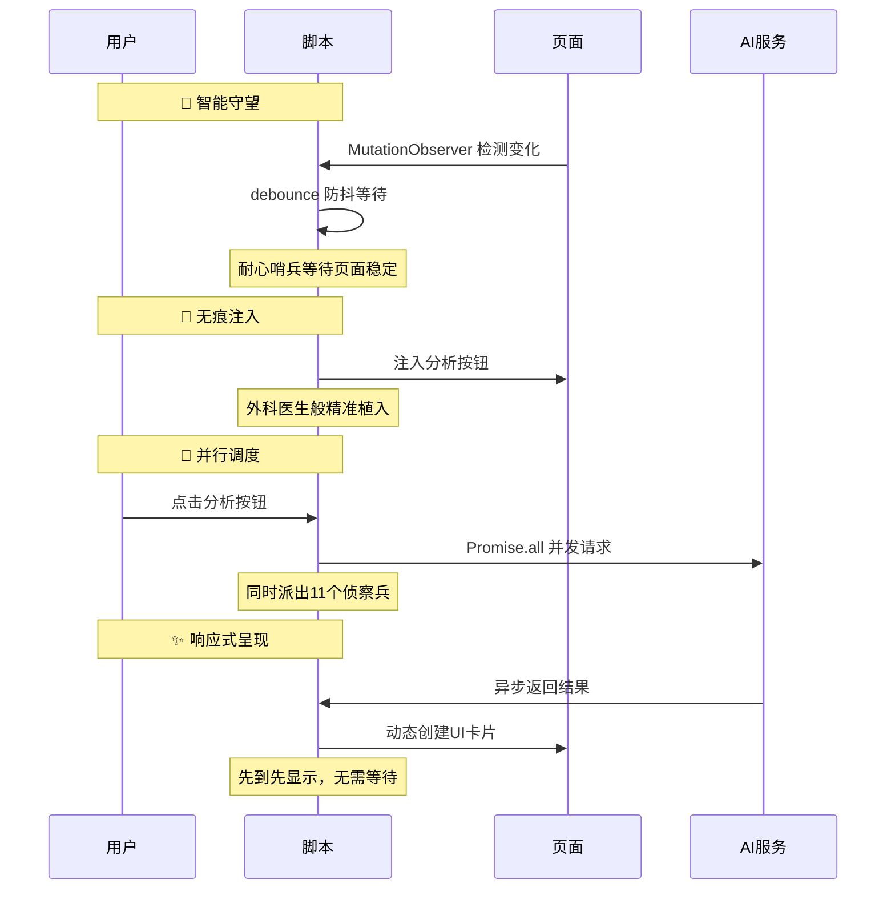
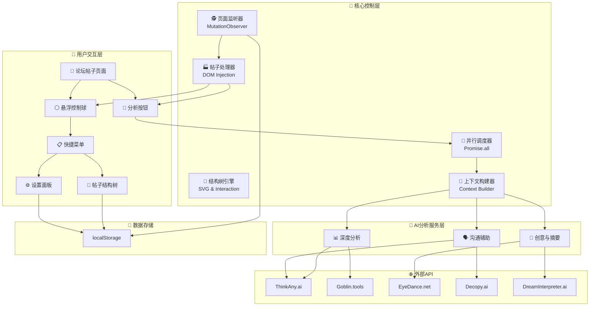
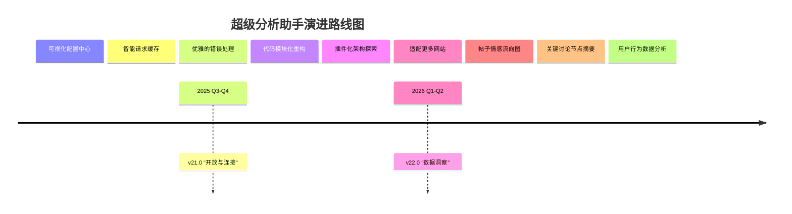

# 🤖 LinuxDo 超级分析助手 v19.4 (综合体验优化版)


**从「信息过载」到「智慧涌现」，这不仅是一次更新，更是一场与信息共舞的认知升级。**

`v19.4` 是一个精益求精的版本。它不仅继承了前代强大的多维分析能力，更在核心体验上实现了质的飞跃：**深度上下文理解**、**暗色模式完美兼容**、**更强大的AI模型**，让您在 `Linux.do` 的每一次浏览，都成为一次充满洞见的探索之旅。

> **项目的核心哲学：** "我们不创造智慧，我们只是智慧的搬运工，并为您点亮通往智慧的所有路径。"
> 在这个信息爆炸的时代，最宝贵的不是答案，而是理解问题的能力。本脚本致力于成为您思想的催化剂，将散乱的信息流重构成有序的知识图谱，让您在每一次点击中，都能感受到思维的深度与广度在同步扩张。我们相信，真正的力量，源于清晰的认知。

---

## 📖 目录

- [🎯 项目概述](#-项目概述)
- [🚀 懒人福音：一键安装](#-懒人福音一键安装三步到位)
- [🛠️ 首次必读：配置向导](#️-首次必读解锁完全体的配置向导)
- [🧭 使用指南](#-使用指南三分钟从入门到精通)
- [🌟 核心功能全家桶](#-核心功能全家桶认识你的-ai-智囊团)
- [💡 核心原理与设计哲学](#-核心原理与设计哲学代码背后的沉思)
- [🔧 技术深度解析](#-技术深度解析从表象到本质)
- [🏗️ 系统架构](#️-系统架构)
- [🚧 项目现状与未来蓝图](#-项目现状不足与未来蓝图)
- [🤝 如何贡献](#-如何贡献成为光的一部分)
- [📜 开源协议](#-开源协议自由的基石)

---

## 🎯 项目概述

**在数字世界的十字路口，你是否也曾遇到过这些困惑？**

- **🤯 高楼迷失**：面对几百层的高楼，信息碎片化，难以快速把握讨论脉络
- **🤔 思考盲点**：分析复杂问题时，渴望能提供全新视角的"第二大脑"
- **✍️ 表达的艺术**：想回复得体又出彩，却在字句间反复斟酌
- **🌉 知识的鸿沟**：看到新概念需要跳出页面搜索，流程繁琐

**LinuxDo 超级分析助手 v19.4，就是您应对这些挑战的"瑞士军刀"与"智慧罗盘"！**

### ✨ 这个脚本为您带来了什么？

1.  **👑 结构化洞察力**：革命性的「帖子结构树」，将线性回复重构为清晰的对话脉络图
2.  **🧠 多维分析矩阵**：一键召唤 **11 个强大的 AI 模型**，全天候待命的"AI智囊团"
3.  **🚀 极致的便利性**：无需离开页面，所有分析结果即时呈现，实现"沉浸式分析"
4.  **😌 愉悦的探索体验**：精心打磨的 UI/UX，完美暗色模式适配和流畅交互动画
5.  **💖 赋能与启发**：激发批判性思维和创造力，让您在交流中更自信、更有深度

### 💔 缺点与代价

- **依赖外部服务**：核心功能依赖第三方API，服务不稳定时功能受影响
- **隐私考量**：分析内容会被发送到第三方API，对敏感用户需谨慎
- **需要手动配置**：部分高级功能需要用户手动配置凭证

---

## 🚀 懒人福音：一键安装，三步到位

让改变即刻发生！

### 第一步：安装「篡改猴 (Tampermonkey)」浏览器扩展

这是运行所有"油猴脚本"的基础。

- [**Chrome / Edge / 国产浏览器 用户** (点击安装)](https://chrome.google.com/webstore/detail/tampermonkey/dhdgffkkebhmkfjojejmpbldmpobfkfo)
- [**Firefox 用户** (点击安装)](https://addons.mozilla.org/firefox/addon/tampermonkey/)

### 第二步：安装「超级分析助手」脚本

👉 **[点击此处，一键安装脚本！](https://github.com/lzA6/js-goblin/raw/main/LinuxDo%20%E8%B6%85%E7%BA%A7%E5%88%86%E6%9E%90%E5%8A%A9%E6%89%8B%20v19.4%20(%E7%BB%BC%E5%90%88%E4%BD%93%E9%AA%8C%E4%BC%98%E5%8C%96%E7%89%88).user.js)** 👈

点击后，篡改猴会弹出确认页面，点击 **`安装`** 即可。

### 第三步：刷新 Linux.do 页面

**大功告成！** 🎉 现在去任意 `linux.do` 帖子下看看，每个帖子右下角都多了一个 **LinuxDo 图标**，全新世界等待探索！

---

## 🛠️ 首次必读：解锁完全体的配置向导

为了唤醒所有 AI 专家，有 **3 个模块** 需要简单配置。

**配置步骤：**

1.  在浏览器右上角找到篡改猴图标 🐒，点击 → **`管理面板`**
2.  找到 `LinuxDo 超级分析助手 v19.4` → 点击 **`编辑`** 📝
3.  在最上方找到配置区域：

    ```javascript
    // --- 1. 配置项 ---
    const THINKANY_COOKIE = "在这里粘贴你的 ThinkAny Cookie";
    const USER_DREAM_COOKIE = '在这里粘贴你的 DreamInterpreter Cookie';
    const DECOPY_PRODUCT_CODE = "067003";
    const DECOPY_PRODUCT_SERIAL = "eb0f5222701cbd6e67799c0cb99ec32b";
    ```

4.  **如何获取凭证？**
    - **`THINKANY_COOKIE`**：登录 [ThinkAny.ai](https://thinkany.ai/)，按 `F12` → `网络`，搜索后找到 `completions` 请求，复制 `cookie` 值
    - **`USER_DREAM_COOKIE`**：访问 [DreamInterpreter.ai](https://www.dreaminterpreter.ai/)，同样方法复制 `cookie` 值
    - **`DECOPY` 凭证**：访问 [Decopy.ai](https://decopy.ai/ai-writer/)，在 `create-job` 请求中复制 `product-code` 和 `product-serial`

5.  **保存配置**：按下 `Ctrl + S`，关闭编辑页面

恭喜！您的超级分析助手现已火力全开！

---

## 🧭 使用指南：三分钟，从入门到精通

### 1. 核心入口：分析按钮 & 悬浮球

- **📝 单个帖子分析**：每个帖子右下角操作栏中的 **LinuxDo 图标**
  - **单击**：在当前帖子下方展开/收起"AI智慧分析面板"
- **🎯 全局控制悬浮球**：页面右下角的 **LinuxDo 图标悬浮球**
  - **拖动**：按住可拖到屏幕任何位置
  - **单击**：展开快捷菜单

### 2. 快捷菜单功能

- **`打开设置`**：勾选默认启用的AI分析模块
- **`帖子结构树`**：打开/关闭思维导图式帖子浏览器
- **`关闭所有卡片`**：一键清理所有已打开的分析面板

### 3. 革命性功能：帖子结构树 🌳

将线性阅读提升到结构化洞察的神器！

**打开方式**：点击悬浮球菜单中的 `帖子结构树`

**交互体验：**
- **🔄 自由探索**：窗口可拖动调整大小，树状图支持鼠标拖动和滚轮缩放
- **📂 逐层深入**：点击节点右侧圆圈，折叠/展开回复分支
- **🎯 精准定位**：单击树节点，页面自动滚动到对应帖子并高亮
- **💾 记忆大师**：记住上次关闭时的窗口状态

**强大的工具栏：**
- `显示内容`：切换节点中帖子内容摘要
- `居中视图`：一键回到完美中心视角
- `复制/导出`：导出帖子结构为文本或 Markdown
- `日志`：查看详细运行日志

### 4. AI 分析卡片交互

每张卡片代表一位"AI专家"报告。卡片右上角工具：
- **📜 `日志`**：查看完整思考过程
- **🔄 `刷新`**：重新生成报告
- **📋 `复制`**：复制报告内容
- **❌ `关闭`**：关闭卡片

---

## 🌟 核心功能全家桶：认识你的 AI 智囊团

v19.4 版本集成了 **11 个** 各具特色的 AI 分析模块：



| 类别 | 专家名 | 职能 | 状态 |
| :--- | :--- | :--- | :--- |
| **沟通辅助** | **AI 回复 (ThinkAny)** | 沟通大师 | ✅ **v19.4 核心增强** |
| | **语气评判** | 情商扫描仪 | ✅ 默认可用 |
| | **建议回应** | 外交辞令官 | ✅ 默认可用 |
| | **简洁回复 (Decopy)** | 语言精炼师 | ⚙️ 需配置 |
| **深度分析** | **网络搜索 (ThinkAny)** | 全知搜索引擎 | ✅ **v19.4 核心增强** |
| | **多维分析** | 语言魔法师 | ✅ 默认可用 |
| | **顾问 (利弊分析)** | 决策分析师 | ✅ 默认可用 |
| | **教授 (深度解析)** | 知识讲解员 | ✅ 默认可用 |
| **创意与摘要** | **文生图 (EyeDance)** | 灵魂画师 | ✅ **v19.4 新增** |
| | **文章摘要** | 速读机器人 | ✅ 默认可用 |
| | **思维导图** | 结构建筑师 | ✅ 默认可用 |
| | **梦境解答** | 弗洛伊德 | ⚙️ 需配置 |

---

## 💡 核心原理与设计哲学：代码背后的沉思

### 技术核心：优雅的四步协奏曲 🎼



### 设计哲学：赋能而非替代

> "A tool becomes a part of your mind." —— "一个好的工具，终将成为你心智的延伸。"

- **无感植入，有感体验**：不需要时安静存在，需要时立刻展开新维度
- **人是主体，AI 是辅助**：提供视角、建议、结构和灵感，决策权永远在您手中
- **从「线性」到「网状」的阅读革命**：通过结构树和思维导图，实现阅读维度的跃迁

---

## 🔧 技术深度解析：从表象到本质

| 技术模块 | 专业术语 | 大白话解释 | 难度 |
| :--- | :--- | :--- | :--- |
| **核心通信** | `GM_xmlhttpRequest` | **"超级信使"**：跨越网页限制，自由向API发送请求 | ★★☆☆☆ |
| **上下文构建** | `getThinkAnyContext()` | **"记忆整理师"**：v19.4智慧核心，打包完整"案情简报"给AI | ★★★☆☆ |
| **动态加载** | `MutationObserver` | **"页面变化侦测器"**：监听页面变化，确保正确时机运行 | ★★★☆☆ |
| **Markdown渲染** | `simpleMarkdownParse()` | **"格式翻译官"**：将Markdown标记翻译成HTML | ★★☆☆☆ |
| **窗口系统** | Draggable & Resizable DOM | **"自由的浮窗"**：通过鼠标事件实现拖动缩放效果 | ★★★★☆ |
| **状态持久化** | `localStorage` | **"浏览器的记事本"**：存储用户设置和状态 | ★☆☆☆☆ |
| **SVG可视化** | Dynamic SVG Generation | **"数据画图师"**：用代码生成可交互的矢量图形 | ★★★★★ |

---

## 🏗️ 系统架构

### 系统架构图



### 文件结构

```
js-goblin/
├── .gitignore          # Git忽略规则
├── LICENSE             # Apache 2.0 许可证
├── README.md           # 项目说明文档
└── LinuxDo 超级分析助手 v19.4 (综合体验优化版).user.js  # 核心源代码
```

---

## 🚧 项目现状、不足与未来蓝图

### ✅ v19.4 已完成的里程碑

- [x] **核心体验升级**：引入 `ThinkAny.ai`，增强上下文理解
- [x] **视觉完美适配**：全面优化暗色模式显示
- [x] **模型更新换代**：集成新的 `EyeDance.net` 模型
- [x] **渲染修复**：修复Markdown格式渲染问题
- [x] **继承并优化**：保留所有强大分析模块

### ⚠️ 当前的不足

1. **凭证管理不便**：API密钥硬编码，需要手动编辑脚本
2. **UI设置功能单一**：只能开关模块，无法深度定制
3. **缺乏请求缓存**：重复分析会发起重复API请求
4. **错误处理不够优雅**：API失败时提示信息简单
5. **代码结构可优化**：所有逻辑在一个文件中，可模块化重构

### 🗺️ 未来演进路线图



**技术演进路径：**

1. **近期 (v20.0)**：
   - **目标**：解决配置和重复请求问题
   - **技术**：使用 `GM_setValue` 配合美观的模态框设置页面

2. **中期 (v21.0)**：
   - **目标**：易于维护和扩展
   - **技术**：模块化重构，研究插件系统设计

3. **远期 (v22.0)**：
   - **目标**：从"工具"进化为"洞察平台"  
   - **技术**：情感可视化，LLM自动摘要

---

## 🤝 如何贡献：成为光的一部分

> "一个人可以走得很快，但一群人才能走得更远。开源的魅力，在于汇聚每一份微小的善意，最终点亮整个星空。"

我们热切欢迎任何形式的贡献：

- **💡 提出想法**：到 [GitHub Issues](https://github.com/lzA6/js-goblin/issues) 分享奇思妙想
- **🐛 报告 BUG**：详细描述问题、复现步骤和环境
- **💻 贡献代码**：Fork 项目，修复BUG或实现新功能，提交 Pull Request
- **✍️ 完善文档**：让后来者更容易理解和使用项目
- **📣 宣传分享**：推荐给朋友，在论坛和社交媒体上分享

> 我们相信，每个人心中都有一颗创造的火种。参与开源，就是点燃它，并用你的光去照亮他人。在这里，您不仅是使用者，更是共建者。来吧，朋友，让我们一起让这个项目变得更酷！

---

## 📜 开源协议：自由的基石

本项目采用 **Apache License 2.0** 开源协议。

**用大白话来说，这意味着：**

- ✅ **你可以**：自由使用、复制、修改、分发代码，包括商业用途
- ✅ **你需要**：保留原始版权声明和许可证文件
- ❌ **你无需**：将修改后的代码也以 Apache 2.0 协议开源

完整的协议内容，请参考仓库中的 [LICENSE](https://github.com/lzA6/js-goblin/blob/main/LICENSE) 文件。

---

**愿代码的逻辑之美，与你同在。愿思想的自由之光，永远闪耀。Happy Hacking! 🚀**
