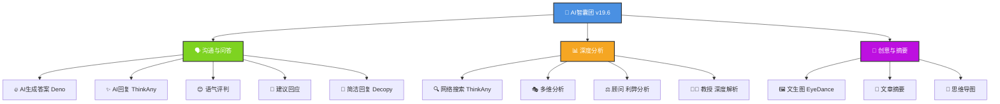
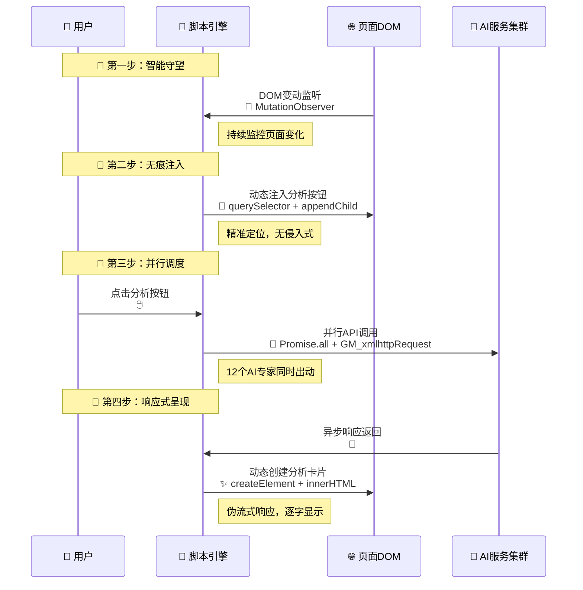
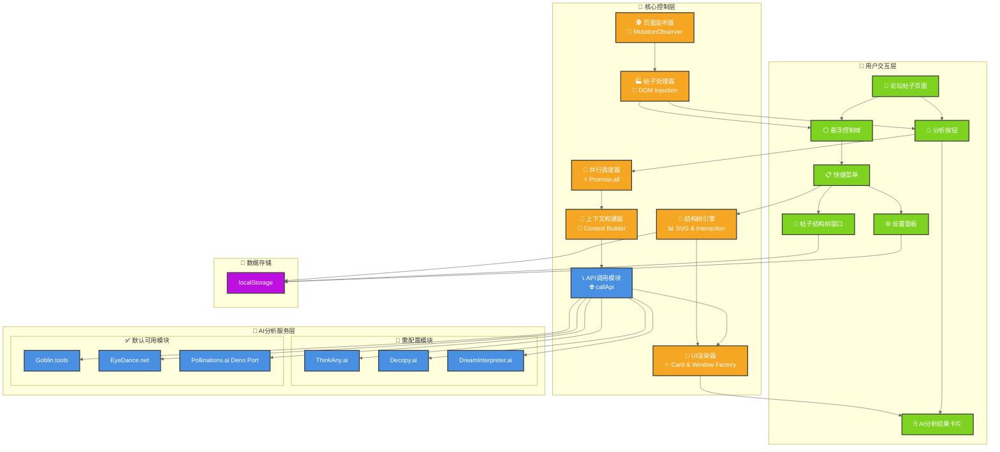
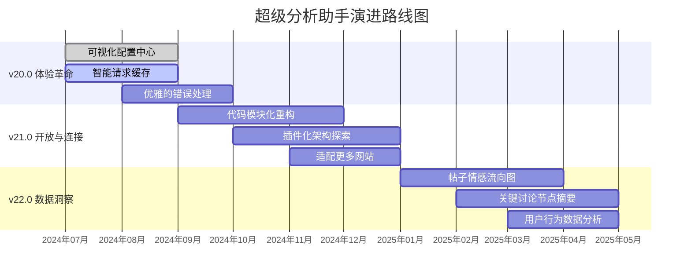

# 🤖 LinuxDo 超级分析助手 v19.6 (Deno 功能集成版)


**从「信息过载」到「智慧涌现」，这不仅是一次更新，更是一场与信息共舞的认知升级。欢迎来到 v19.6，一个集成了开源社区智慧结晶的全新版本！**

> **项目的核心哲学：** "我们不创造智慧，我们只是智慧的搬运工，并为您点亮通往智慧的所有路径。"
> 在这个信息爆炸的时代，最宝贵的不是答案，而是理解问题的能力。本脚本致力于成为您思想的催化剂，将散乱的信息流重构成有序的知识图谱，让您在每一次点击中，都能感受到思维的深度与广度在同步扩张。

---

## 📖 目录

- 🌟 [v19.6 更新日志](#-v196-更新日志deno-之心注入)
- 🎯 [项目概述](#-项目概述)
- 🚀 [懒人福音：一键安装](#-懒人福音一键安装三步到位)
- 🛠️ [首次必读：配置向导](#️-首次必读解锁完全体的配置向导)
- 🧭 [使用指南](#-使用指南三分钟从入门到精通)
- 🤖 [核心功能全家桶](#-核心功能全家桶认识你的-ai-智囊团)
- 💡 [核心原理与设计哲学](#-核心原理与设计哲学代码背后的沉思)
- 🔧 [技术深度解析](#-技术深度解析从表象到本质)
- 🏗️ [系统架构与文件结构](#️-系统架构与文件结构)
- 🚧 [项目现状、不足与未来蓝图](#-项目现状不足与未来蓝图)
- 🤝 [如何贡献](#-如何贡献成为光的一部分)
- 📜 [开源协议](#-开源协议自由的基石)

---

## 🌟 v19.6 更新日志：Deno 之心，注入！

`v19.6` 版本的核心是一次"心脏移植手术"——我们成功地将来自开源社区 `aianswergenerator-2api (Deno)` 项目的核心功能集成进来，这不仅是功能的增加，更是开源精神的胜利！

### ✨ 新增功能
- **🔥 AI 生成答案 (Deno Port) 模块**：引入了一个全新的、强大的、无需配置的 AI 对话模型
- **🎨 专属 UI 卡片**：为新模块设计了独特的 UI 卡片和配色方案
- **🧠 上下文支持**：新模块支持强大的上下文理解能力
- **💧 伪流式响应**：实现了打字机般的伪流式响应效果

### 🚀 性能优化
- **🔄 继承并巩固**：v19.4 版本的所有优点
- **🎯 完美暗色模式**：深色/浅色主题完美适配
- **🌳 强大的帖子结构树**：稳定的多维分析能力

---

## 🎯 项目概述

**在数字世界的十字路口，你是否也曾遇到过这些困惑？**

- **🤯 高楼迷失**：面对几百层的高楼，难以快速把握讨论脉络？
- **🤔 思考盲点**：分析复杂问题时，渴望能提供全新视角的"第二大脑"？
- **✍️ 表达的艺术**：想回复得体又出彩，却在字句间反复斟酌？
- **🌉 知识的鸿沟**：看到新概念需要跳出页面搜索，流程繁琐？

**LinuxDo 超级分析助手 v19.6，就是您应对这些挑战的"瑞士军刀"与"智慧罗盘"！**

### ✨ 核心价值

1.  **👑 结构化洞察力**：革命性的「帖子结构树」，将线性回复重构为清晰的对话脉络图
2.  **🧠 多维分析矩阵**：一键召唤 **12 个强大的 AI 模型**，全天候待命的"AI智囊团"
3.  **🚀 极致的便利性**：无需离开页面，所有分析结果即时呈现
4.  **😌 愉悦的探索体验**：精心打磨的 UI/UX，完美适配深/浅色主题
5.  **💖 赋能与启发**：思想的催化剂，激发批判性思维和创造力

### ⚠️ 使用须知

- **依赖外部服务**：核心功能依赖第三方API
- **隐私考量**：帖子内容会被发送到第三方API
- **需要手动配置**：部分高级功能需要手动配置凭证

---

## 🚀 懒人福音：一键安装，三步到位

### 第一步：安装「篡改猴 (Tampermonkey)」浏览器扩展

这是运行所有"油猴脚本"的基础设施。

- **Chrome / Edge / 国产浏览器 用户**：[从 Chrome 商店安装](https://chrome.google.com/webstore/detail/tampermonkey/dhdgffkkebhmkfjojejmpbldmpobfkfo)
- **Firefox 用户**：[从 Firefox 附加组件安装](https://addons.mozilla.org/firefox/addon/tampermonkey/)

### 第二步：安装「超级分析助手」脚本

👉 **[点击此处，一键安装脚本！](https://github.com/lzA6/js-goblin/raw/main/LinuxDo%20%E8%B6%85%E7%BA%A7%E5%88%86%E6%9E%90%E5%8A%A9%E6%89%8B%20v19.6%20(Deno%20%E5%8A%9F%E8%83%BD%E9%9B%86%E6%88%90%E7%89%88).user.js)** 👈

### 第三步：刷新 Linux.do 页面

**大功告成！** 🎉 现在去任意 `linux.do` 帖子下看看，每个帖子右下角都多了一个 **LinuxDo 图标**。

---

## 🛠️ 首次必读：解锁完全体的配置向导

为了唤醒所有 AI 专家，有 **3 个模块** 需要简单配置。

### 配置步骤

1.  在浏览器右上角找到篡改猴图标 🐒，点击选择 **`管理面板`**
2.  找到 `LinuxDo 超级分析助手 v19.6`，点击 **`编辑`** 📝 图标
3.  在代码编辑器中找到配置区域：

```javascript
// ==== 用户配置区域 ====
const THINKANY_COOKIE = "在这里粘贴你的 ThinkAny Cookie";
const USER_DREAM_COOKIE = '在这里粘贴你的 DreamInterpreter Cookie';
const DECOPY_PRODUCT_CODE = "067003";
const DECOPY_PRODUCT_SERIAL = "eb0f5222701cbd6e67799c0cb99ec32b";
```

### 凭证获取指南

- **`THINKANY_COOKIE`** (用于 AI 回复 / 网络搜索):
  1. 登录 [ThinkAny.ai](https://thinkany.ai/)
  2. 按 `F12` → `网络(Network)` → 进行搜索 → 复制 `completions` 请求的 `cookie`

- **`USER_DREAM_COOKIE`** (用于梦境解答):
  1. 访问 [DreamInterpreter.ai](https://www.dreaminterpreter.ai/)
  2. 按 `F12` → 复制主域名请求的 `cookie`

- **`DECOPY` 凭证** (用于简洁回复):
  1. 访问 [Decopy.ai](https://decopy.ai/ai-writer/)
  2. 按 `F12` → 找到 `create-job` 请求 → 复制 `product-code` 和 `product-serial`

4.  **保存配置**：粘贴值后按 `Ctrl + S` 保存

---

## 🧭 使用指南：三分钟，从入门到精通

### 1. 核心入口

- **📝 单个帖子分析**：每个帖子右下角的 **LinuxDo 图标**
  - **单击**：在当前帖子下方展开/收起"AI智慧分析面板"
- **🎯 全局控制悬浮球**：页面右下角的 **LinuxDo 图标悬浮球**
  - **拖动**：按住可拖动到屏幕任意位置
  - **单击**：展开快捷菜单

### 2. 快捷菜单功能

- `🌓 切换到浅色/深色模式`：一键切换主题
- `⚙️ 打开设置`：自定义默认启用的AI分析模块
- `🌳 帖子结构树`：打开/关闭思维导图式的帖子浏览器
- `🗑️ 关闭所有卡片`：一键清理所有分析面板

### 3. 革命性功能：帖子结构树 🌳

将线性阅读提升到结构化洞察的神器！

**打开方式**：点击悬浮球菜单中的 `帖子结构树`

**交互体验：**
- **🔄 自由探索**：窗口可拖动和调整大小，树状图支持拖动和缩放
- **📂 逐层深入**：点击节点右侧圆圈，折叠/展开回复分支
- **🎯 精准定位**：单击树节点，页面自动滚动到对应帖子
- **💾 记忆大师**：记住上次关闭时的窗口状态

**工具栏功能：**
- `📄 显示内容`：切换节点内容摘要显示
- `🎯 居中视图`：一键回到中心视角
- `📋 复制/导出`：导出结构为文本或 Markdown
- `📊 日志`：查看运行日志

### 4. AI 分析卡片交互

每张卡片代表一位"AI专家"的专属报告：

- **📜 `日志`**：查看完整的API请求和响应日志
- **🔄 `刷新`**：重新生成分析结果
- **📋 `复制`**：一键复制报告内容
- **❌ `关闭`**：关闭卡片

---

## 🤖 核心功能全家桶：认识你的 AI 智囊团

v19.6 版本集成了 **12 个** 各具特色的 AI 分析模块：



### 功能模块详情

| 类别 | 专家名 | 职能描述 | 状态 |
| :--- | :--- | :--- | :--- |
| **🗣️ 沟通与问答** | **🔥 AI 生成答案 (Deno)** | **"万事通"**，直接回答你的问题 | ✅ **v19.6 核心新增** |
| | **✨ AI 回复 (ThinkAny)** | **"沟通大师"**，构思富有洞见的回复 | ⚙️ 需配置 |
| | **😊 语气评判** | **"情商扫描仪"**，解读文字背后的情绪 | ✅ 默认可用 |
| | **💬 建议回应** | **"外交辞令官"**，提供建设性回应建议 | ✅ 默认可用 |
| | **🎯 简洁回复 (Decopy)** | **"语言精炼师"**，提炼冗长内容 | ⚙️ 需配置 |
| **📊 深度分析** | **🔍 网络搜索 (ThinkAny)** | **"全知搜索引擎"**，结合实时网络信息 | ⚙️ 需配置 |
| | **🎭 多维分析** | **"语言魔法师"**，变换多种风格 | ✅ 默认可用 |
| | **⚖️ 顾问 (利弊分析)** | **"决策分析师"**，分析正反两面 | ✅ 默认可用 |
| | **👨‍🏫 教授 (深度解析)** | **"知识讲解员"**，解释复杂概念 | ✅ 默认可用 |
| **🎨 创意与摘要** | **🖼️ 文生图 (EyeDance)** | **"灵魂画师"**，文字转图像 | ✅ 默认可用 |
| | **📰 文章摘要** | **"速读机器人"**，总结文章核心内容 | ✅ 默认可用 |
| | **🧩 思维导图** | **"结构建筑师"**，文字转思维导图 | ✅ 默认可用 |

---

## 💡 核心原理与设计哲学：代码背后的沉思

### 技术核心：优雅的四步协奏曲 🎼



### 设计哲学

- **无感植入，有感体验**：不需要时安静待命，需要时即刻响应
- **人是主体，AI 是辅助**：AI 是"副驾驶"，不是"自动驾驶"
- **从「线性」到「网状」**：将线性阅读提升到结构化洞察

---

## 🔧 技术深度解析：从表象到本质

| 技术模块 | 专业术语 | 👨‍🏫 大白话解释 | ⭐ 当前实现 | 🚀 未来升级 |
| :--- | :--- | :--- | :--- | :--- |
| **核心通信** | `GM_xmlhttpRequest` | **"超级信使"**：跨越浏览器安全限制的自由通信 | ★★★☆☆ | ★★★★☆<br/>增加重试、队列控制 |
| **上下文构建** | `getContextualContent()` | **"记忆整理师"**：打包清晰的"案情简报"给AI | ★★★★☆ | ★★★★★<br/>智能上下文选择 |
| **动态加载** | `MutationObserver` | **"页面变化侦测器"**：监视页面变动 | ★★★☆☆ | ★★★★☆<br/>按需注入优化 |
| **伪流式响应** | `setTimeout` + 字符串操作 | **"打字机特效"**：模拟流畅的生成感 | ★★★☆☆ | ★★★★★<br/>真实流式API |
| **Markdown渲染** | `simpleMarkdownParse()` | **"格式翻译官"**：基础Markdown转HTML | ★★☆☆☆ | ★★★★☆<br/>成熟库支持 |
| **窗口系统** | 可拖动DOM元素 | **"自由的浮窗"**：完全可控的浮动窗口 | ★★★★☆ | ★★★★★<br/>窗口吸附管理 |
| **状态持久化** | `localStorage` | **"浏览器的记事本"**：本地保存设置 | ★★★☆☆ | ★★★★☆<br/>健壮状态管理 |
| **SVG可视化** | 动态SVG生成 | **"数据画图师"**：JavaScript绘制图形 | ★★★★☆ | ★★★★★<br/>专业布局库 |

---

## 🏗️ 系统架构与文件结构

### 系统架构图



### 文件结构

```
js-goblin/
├── .gitignore          # Git忽略规则
├── LICENSE             # Apache 2.0 许可证
├── README.md           # 项目文档
└── LinuxDo 超级分析助手 v19.6 (Deno 功能集成版).user.js  # 核心源代码
```

---

## 🚧 项目现状、不足与未来蓝图

### ✅ v19.6 已完成的里程碑

- [x] **核心体验升级**：引入 `ThinkAny.ai` 和 `Deno Port`
- [x] **视觉完美适配**：深/浅色模式全面优化
- [x] **模型更新换代**：集成新的创意生成模型
- [x] **交互优化**：伪流式响应，Markdown修复
- [x] **继承并优化**：保留历代版本强大功能

### ⚠️ 当前的不足

1.  **凭证管理不便**：API密钥硬编码，需要手动编辑脚本
2.  **UI设置功能单一**：只能简单开关模块，缺乏深度定制
3.  **缺乏请求缓存**：重复分析会发起重复API请求
4.  **错误处理不够优雅**：简单的错误信息显示
5.  **代码结构可优化**：所有逻辑集中在单个文件

### 🗺️ 未来演进路线图



**技术演进路径：**

1.  **近期 (v20.0)**：解决配置难和重复请求问题
2.  **中期 (v21.0)**：代码模块化，易于维护扩展
3.  **远期 (v22.0)**：从工具进化为社区洞察平台

---

## 🤝 如何贡献：成为光的一部分

> "一个人可以走得很快，但一群人才能走得更远。"

我们热切欢迎任何形式的贡献：

- **💡 提出想法**：到 [GitHub Issues](https://github.com/lzA6/js-goblin/issues) 分享创意
- **🐛 报告 BUG**：提交详细的BUG报告和环境信息
- **💻 贡献代码**：Fork 项目，修复BUG或实现新功能
- **✍️ 完善文档**：让文档更清晰易懂
- **📣 宣传分享**：推荐给朋友，在社交媒体分享

> 我们相信，每个人心中都有一颗创造的火种。参与开源，就是点燃它，并用你的光去照亮他人。

---

## 📜 开源协议：自由的基石

本项目采用 **Apache License 2.0** 开源协议。

**核心条款：**

- ✅ **你可以**：自由使用、复制、修改、分发，包括商业用途
- ✅ **你需要**：保留原始版权声明和许可证文件
- ❌ **你无需**：将修改后的代码以相同协议开源

完整协议内容请参考 [LICENSE](https://github.com/lzA6/js-goblin/blob/main/LICENSE) 文件。

---

**愿代码的逻辑之美，与你同在。愿思想的自由之光，永远闪耀。Happy Hacking! 🚀**
