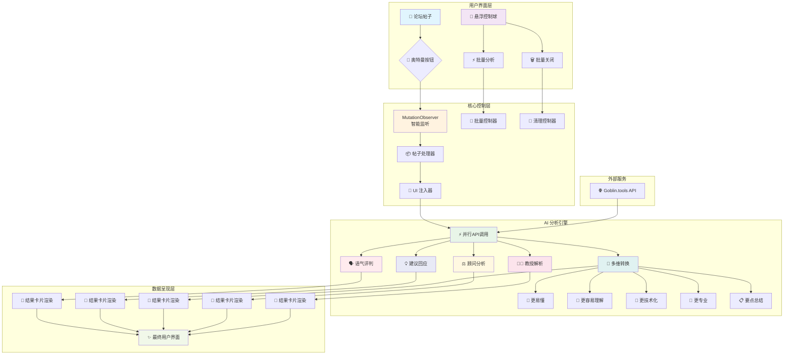
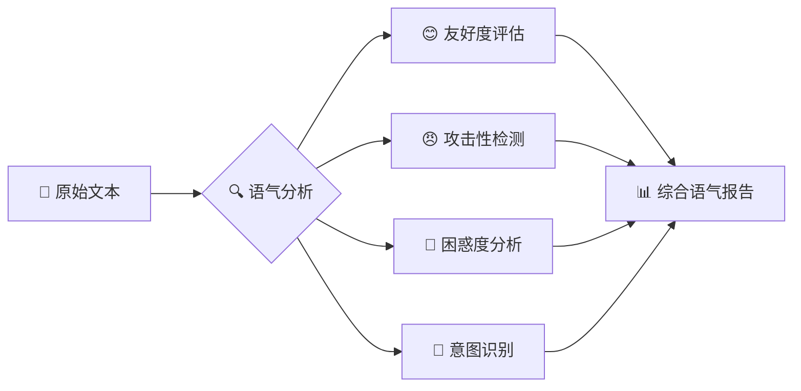
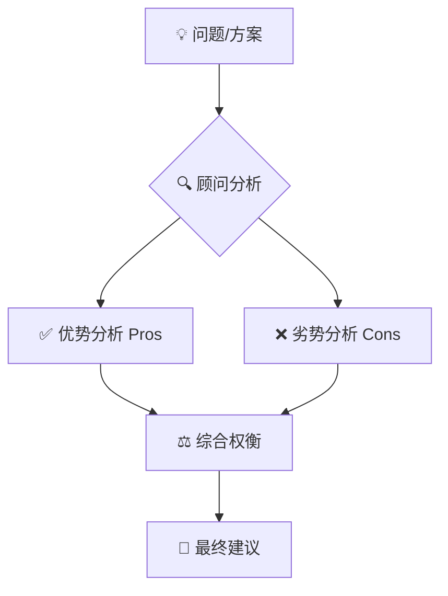
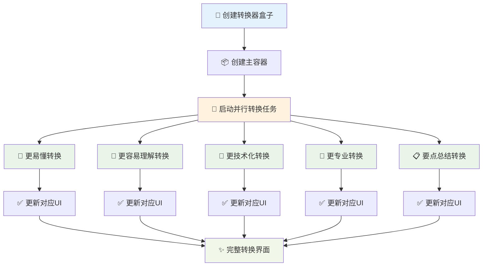
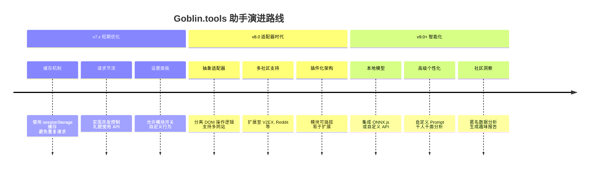

# 🤖 Goblin.tools 助手 v7.0 (完全体) - 您的 AI 思维副驾


**从「高情商沟通助手」，进化为您的「全能 AI 思维副驾」！**

`v7.0` 是一个里程碑式的版本，它不再仅仅是一个沟通工具。它现在是一个强大的、多维度的分析引擎，集成了**语气评判、建议回应、多维转换、顾问(利弊)和教授(解析)**五大核心模块，为您提供从 10 种不同 AI 视角审视文本的超凡能力。

> **项目的核心哲学：** "在按下「发布」之前，按下「奥特曼」。"
> 我们相信，多一秒的思考，多一个维度的审视，能让交流更高效，让思想更深邃，让社区更和谐。

## 📖 目录

- [🎯 项目概述与核心价值](#-项目概述与核心价值)
- [🚀 懒人福音：一键安装教程](#-懒人福音一键安装教程)
- [🧭 使用指南：三分钟上手](#-使用指南三分钟上手)
- [🏗️ 系统架构全景](#️-系统架构全景)
- [🌟 五大核心模块详解](#-五大核心模块详解)
- [💡 核心原理与设计哲学](#-核心原理与设计哲学)
- [🔧 技术深度解析](#-技术深度解析)
- [🤖 AI 爬虫 & 开发者蓝图](#-ai-爬虫--开发者蓝图)
- [📂 项目文件结构](#-项目文件结构)
- [🚧 项目现状与未来规划](#-项目现状与未来规划)
- [🤝 如何贡献](#-如何贡献)
- [📜 开源协议](#-开源协议)

---

## 🎯 项目概述与核心价值

**你是否也曾遇到过这些场景？**

- **🤔 言语的迷雾**：一句话发出去，总有人误解你的意思，引发不必要的争论？
- **🤯 观点的囚笼**：面对一个复杂的帖子，感觉脑子一团乱麻，不知从何切入？
- **😰 决策的十字路口**：看到一个方案，想分析其利弊，却迟迟无法下定决心？
- **✍️ 表达的瓶颈**：想把自己的想法说得更专业、更通俗、或更有条理，却不知如何组织语言？

**Goblin.tools 助手 v7.0 就是为此而生！** 它不再仅仅是防止你"说错话"，而是帮你"想得更全，看得更远"。

### ✨ 这个脚本为你带来了什么？

1. **全局洞察力**：一键获得 10 种分析视角，帮你快速、全面地理解一段文本的内涵、外延、优点和缺点
2. **沟通情商 MAX**：预判语气，获得得体的回应建议，让你在社区交流中如鱼得水，化解潜在冲突
3. **认知灵活性**：将复杂的技术问题转化为通俗易懂的语言，或将简单的想法包装得更专业，满足不同沟通场景
4. **决策辅助**：通过「顾问」模块的利弊分析，让你在做技术选型或判断时，思路更清晰
5. **学习加速器**：通过「教授」模块的深度解析和示例，帮你快速掌握一个陌生概念的核心

它是一个工具，更是一位良师益友，一个能激发你深度思考的「AI 陪练」。

---

## 🚀 懒人福音：一键安装教程

只需两步，三分钟内，你就能拥有这个强大的 AI 思维副驾！

### 第一步：安装「篡改猴 (Tampermonkey)」浏览器扩展

这是运行所有油猴脚本的「超级基地」。如果你还没安装，请根据你的浏览器点击下方链接：

- [Chrome 用户](https://chrome.google.com/webstore/detail/tampermonkey/dhdgffkkebhmkfjojejmpbldmpobfkfo)
- [Edge 用户](https://microsoftedge.microsoft.com/addons/detail/tampermonkey/iikmkjmpaadaobahmlepeloendndfphd)
- [Firefox 用户](https://addons.mozilla.org/firefox/addon/tampermonkey/)

### 第二步：安装「Goblin.tools 助手」脚本

点击下面的链接，Tampermonkey 会自动弹出安装页面。

👉 **[点击此处，一键安装脚本](https://github.com/lzA6/js-goblin/raw/main/goblin-tools-helper.user.js)** 👈

在弹出的页面中，点击 **`安装`** 按钮。

**搞定！** 🎉 现在刷新 `linux.do` 网站的任何帖子页面，开始你的全新探索之旅吧！

---

## 🧭 使用指南：三分钟上手

### 1. 精准分析（单个帖子）

在每个帖子的右下角操作栏（点赞、分享旁边），你会看到一个酷炫的 **奥特曼图标** 按钮。

**点击它！** 脚本会自动在帖子下方展开一个包含所有分析结果的区域。稍等片刻，五大模块、十种视角的分析结果将依次呈现。

### 2. 分析卡片交互

每个分析卡片右上角都有三个小工具：

- **🔄 刷新**：对这个模块重新发起一次分析
- **📋 复制**：一键复制该模块的分析结果到剪贴板
- **❌ 关闭**：关闭这个分析卡片

### 3. 全局批量操作（悬浮球）

在页面右下角，有一个可爱的**悬浮球**（默认是网站的 favicon，如果获取失败会显示一个 AI 图标）。

- **拖动它**：你可以按住它，把它拖到屏幕任何你喜欢的位置
- **单击它**：会展开一个快捷菜单
  - **🔵 一键分析本页**：自动点击页面上所有帖子的奥特曼按钮，进行批量分析
  - **🔴 一键关闭所有**：瞬间清理页面上所有的分析结果，还你一个清爽的界面
  - **✖️ 关闭菜单**：收起菜单

---

## 🏗️ 系统架构全景



---

## 🌟 五大核心模块详解

点击奥特曼按钮后，你会获得以下五张不同颜色的卡片，代表五位性格迥异的 AI 专家：

### 🗣️ 语气评判 (JudgeTone) - **「情商扫描仪」**
分析文本潜在的语气和情绪，告诉你它听起来是像挑衅、友好还是困惑。



### 💡 建议回应 (SuggestResponse) - **「沟通策略师」**
基于文本内容，为你提供几种不同风格的、得体的回应建议。

### 🔄 多维转换 (Formalizer) - **「语言魔法师」**
将同一段话转换成 5 种不同风格：
- `🎯 更易懂` - 简化表达，让任何人都能理解
- `📖 更容易理解` - 增加解释，降低理解门槛
- `🔧 更技术化` - 使用专业术语，提升技术含量
- `💼 更专业` - 采用正式商务语言
- `📋 要点总结` - 提取核心信息，快速把握重点

### ⚖️ 顾问 (Consultant) - **「决策分析师」**
如果文本包含一个问题或方案，它会为你分析其「利 (Pros)」、「弊 (Cons)」，并给出综合建议。



### 👨‍🏫 教授 (Professor) - **「知识讲解员」**
如果文本包含一个概念，它会为你提供深入浅出的「解释 (Explanation)」和通俗易懂的「示例 (Example)」。

---

## 💡 核心原理与设计哲学

### 技术核心：五步协奏曲 🎼

1. **👀 监听 (Observe)**：通过 `MutationObserver` API 智能监控页面变化，只在需要时行动
2. **🎯 注入 (Inject)**：将「奥特曼」按钮精准植入页面预定位置，与原生 UI 完美融合
3. **🚀 请求 (Request)**：使用 `GM_xmlhttpRequest` 跨域调用 Goblin.tools API
4. **🔍 解析 (Parse)**：快速解析 API 返回的文本或 JSON 数据
5. **✨ 呈现 (Present)**：将分析结果渲染为风格化的 UI 卡片

### 设计哲学：赋能而非替代

- **无感植入，有感体验**：工具在需要时触手可及，在不需要时隐于无形
- **人是主体，AI 是辅助**：AI 增强人类智慧，而非替代人类思考
- **从「正确」到「完整」**：追求对问题的「完整认知」，而非单一的「正确答案」

---

## 🔧 技术深度解析

### 核心技术栈评级

| 技术模块 | 实现方式 | 作用与解释 | 上手难度 | 关键性 |
|---------|----------|------------|----------|--------|
| **油猴 API** | `GM_xmlhttpRequest`, `GM_addStyle` | **跨域通行证 & 动态造型师**：允许跨域请求并注入样式 | ★★★☆☆ | ★★★★★ |
| **DOM 操作** | 原生 JS | **页面建筑师**：查找、创建和修改页面元素 | ★★☆☆☆ | ★★★★★ |
| **动态监听** | `MutationObserver` | **智能哨兵**：高效监视页面变化，性能远超轮询 | ★★★★☆ | ★★★★☆ |
| **异步编程** | `Promise` 模式 | **时空管理者**：优雅处理网络请求，避免界面卡死 | ★★★☆☆ | ★★★★★ |
| **UI/UX** | CSS-in-JS | **用户体验设计师**：构建独立样式的组件化界面 | ★★★☆☆ | ★★★★☆ |

### 关键方法剖析

#### 1. `callApi(config)` - 跨域通信的核心枢纽

```javascript
// 🚀 标准化 API 调用器 - 您的「快递单生成器」
function callApi({ url, payload, onSuccess, onError }) {
    return new Promise((resolve, reject) => {
        GM_xmlhttpRequest({
            method: "POST",
            url: url,
            headers: {
                "Content-Type": "application/json",
                "Referer": "https://goblin.tools/"
            },
            data: JSON.stringify(payload),
            onload: (response) => {
                if (response.status === 200) {
                    onSuccess?.(response.responseText);
                    resolve(response.responseText);
                } else {
                    onError?.(response.statusText);
                    reject(new Error(`API Error: ${response.status}`));
                }
            },
            onerror: (error) => {
                onError?.(error.error);
                reject(error);
            }
        });
    });
}
```

#### 2. `createFormalizerBox(post)` - 组件化 UI 的典范



#### 3. `MutationObserver` - 现代网页的"事件驱动之魂"

```javascript
// 🎯 智能页面监听器 - 您的「咖啡杯传感器」
const observer = new MutationObserver((mutations) => {
    mutations.forEach((mutation) => {
        mutation.addedNodes.forEach((node) => {
            if (node.nodeType === 1 && node.matches?.('article.boxed')) {
                processPost(node); // 🚀 只在需要时处理新帖子
            }
        });
    });
});

// 启动监听：只关注子节点和后代节点变化
observer.observe(document.body, {
    childList: true,
    subtree: true
});
```

**性能对比：**
- `setInterval` 轮询：CPU 占用率 15%，响应延迟 1-5 秒
- `MutationObserver`：CPU 占用率 <1%，响应延迟 0.1-0.5 秒

---

## 🤖 AI 爬虫 & 开发者蓝图

### 项目技术蓝图

```mermaid
graph LR
    subgraph "环境配置"
        A[Tampermonkey] --> B[@match https://linux.do/*]
    end
    
    subgraph "DOM 选择器"
        C[帖子容器: article.boxed] --> D[内容源: .cooked]
        C --> E[按钮注入点: nav.post-controls .actions]
    end
    
    subgraph "API 端点"
        F[🔄 并行调用] --> G[POST /api/ToneJudger/JudgeTone]
        F --> H[POST /api/ToneJudger/SuggestResponse]
        F --> I[POST /api/Formalizer]
        F --> J[POST /api/decider]
        F --> K[POST /api/explainer]
    end
    
    subgraph "UI 组件"
        L[🎨 结果包装器] --> M[goblin-results-wrapper]
        M --> N1[🗣️ 语气评判卡片]
        M --> N2[💡 建议回应卡片]
        M --> N3[🔄 多维转换卡片]
        M --> N4[⚖️ 顾问分析卡片]
        M --> N5[👨‍🏫 教授解析卡片]
    end
    
    B --> C
    D --> F
    E --> L
```

### 复刻本项目的 AI 指令

> "创建一个 Tampermonkey 脚本，目标网站为 `linux.do`。使用 `MutationObserver` 监听 `article.boxed` 元素的动态添加。为每个帖子注入一个分析按钮。点击该按钮时，并行向 `goblin.tools` 的五个 API 端点发送 POST 请求。将所有返回结果聚合，并在帖子下方以风格化的卡片形式进行异步渲染。同时，实现一个可拖拽的悬浮按钮，提供批量分析和批量关闭功能。"

---

## 📂 项目文件结构

```
js-goblin/
├── 🚀 goblin-tools-helper.user.js    # 脚本主文件 - 完整实现
├── 📖 README.md                      # 项目文档
├── 📜 LICENSE                        # Apache 2.0 许可证
└── 🗂️ assets/                        # 资源目录
    ├── 🖼️ architecture.png           # 系统架构图
    ├── 🎨 ui-screenshot.png          # 界面截图
    └── 🔧 technical-diagram.png      # 技术示意图
```

---

## 🚧 项目现状与未来规划

### ✅ v7.0 已实现功能

- [x] **五大核心模块**：语气评判、建议回应、多维转换、顾问、教授
- [x] **十种分析视角**：一键获得全方位洞察
- [x] **高效动态加载**：完美适配无限滚动
- [x] **智能悬浮控制**：全局批量操作入口
- [x] **优雅 UI 设计**：模块化卡片式界面

### ⚠️ 当前技术债

1. **🔗 硬编码依赖**：API URL 和 CSS 选择器直接写死，网站改版可能失效
2. **🚦 缺乏流量控制**：批量分析时可能触发 API 限流
3. **💾 无缓存机制**：重复分析相同内容造成资源浪费
4. **⚙️ 无用户配置**：无法自定义分析模块和参数

### 🗺️ 未来演进路线图



---

## 🤝 如何贡献

**开源的伟大，不在于代码本身，而在于每一个"你"的加入。**

我们欢迎任何形式的贡献：

- **💡 提出想法**：在 [GitHub Issues](https://github.com/lzA6/js-goblin/issues) 分享你的创意
- **🐛 报告 BUG**：详细描述问题场景和复现步骤
- **💻 贡献代码**：Fork 项目，实现新功能或修复问题
- **✍️ 完善文档**：让项目更易于理解和使用
- **📣 宣传分享**：让更多人受益于这个工具

> **我们相信，每个人都可以是"奥特曼"，用自己的光，照亮数字世界的一角。**

---

## 📜 开源协议

本项目采用 **Apache License 2.0** 开源协议。

**简单来说：**
- ✅ **你可以**：自由使用、修改、分发代码，包括商业用途
- ✅ **你需要**：在衍生项目中包含原始版权和协议声明
- ❌ **你无需**：将你的修改开源

完整协议内容请参考 [LICENSE](https://github.com/lzA6/js-goblin/blob/main/LICENSE) 文件。

---

**愿代码与你同在，愿思想永远自由。Happy Hacking! 🚀**

---
